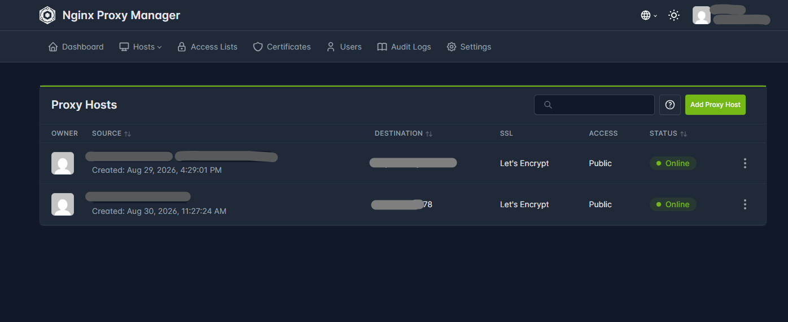
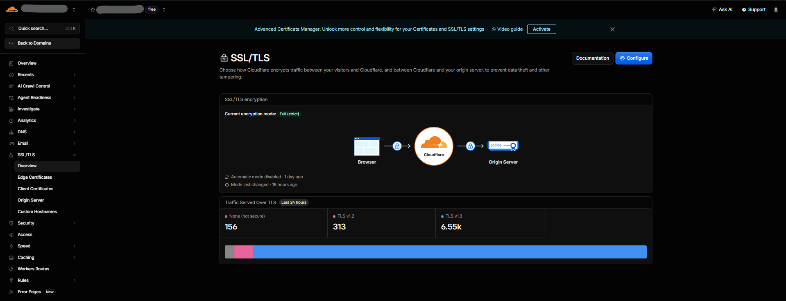
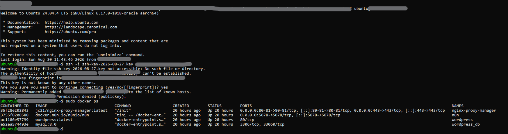
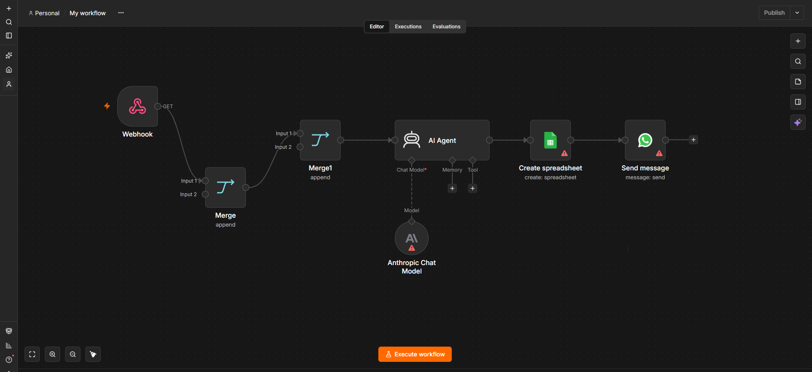

# Self-Hosted Cloud Infrastructure & Website Deployment

A production-grade, self-hosted server architecture deployed on an Oracle Cloud Ubuntu VPS. This repository contains the Docker Compose configurations and routing logic used to securely host multi-container web and automation workloads for a private production environment.

---

## Architecture Overview

This infrastructure utilizes a reverse proxy to handle external DNS routing, SSL termination, and secure internal container communication. 

* **Hosting:** Oracle Cloud Infrastructure (Always Free Tier Ubuntu VPS)
* **Containerization:** Docker & Docker Compose
* **Traffic Routing & SSL:** Nginx Proxy Manager, Cloudflare DNS (Full Strict Mode)
* **Workloads:** 
  * WordPress (CMS) + MySQL 8.0 (Database)
  * n8n (Workflow Automation Engine)

---

## Security & Network Design

* **Internal Docker Networks:** Services communicate over isolated custom bridge networks (`proxied`) to prevent unauthorized port exposure.
* **Environment Variables:** Credentials and database keys are injected dynamically via `.env` files (see `.env.example` for the structure).
* **HTTPS/TLS:** Automated Let's Encrypt certificates managed through Nginx Proxy Manager, combined with Cloudflare's proxy shield to prevent direct IP access.

---

## System Verification & Dashboard Screenshots

*A visual look at the live server deployment, reverse proxy routing, and security posture:*

### 1. Reverse Proxy Routing (Nginx Proxy Manager)
Managing SSL certificates and routing traffic internally to Docker container endpoints.

### 2. Edge Security & SSL Handshake (Cloudflare)
Configured with Full (Strict) SSL/TLS encryption mode to ensure end-to-end transport security.

### 3. Container Architecture Status (`docker ps`)
Live verification of container stability and port mapping on the Ubuntu VPS.

### 4. Workflow Automation Engine (n8n)
Active backend automation workspace securely served via custom subdomain routing.

---

## Author
**Raza Yaseen**  
Technical (AI/Software) Projects and BizOps Lead.
